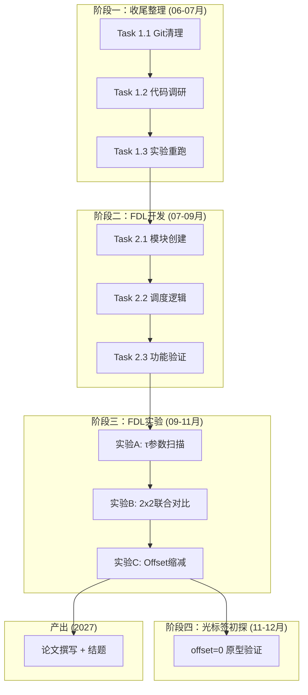

# OBS 研究重启指南（Opus-Gemini 协作版）

*更新日期：2026-06-29 | 项目结题：2027-09*

> **2026-09-14 计划重定向（下方历史 Gemini 提示词保持原样，不要当现行周次表）**  
> 执行计划与叙事以 `research_status.md` 第十节为唯一源；周次表以 `research_reports/00-project-management/codex_phase2_tasks.md` 为准。  
> 第一篇论文骨架：`research_reports/2026-09-week6-novelty/论文骨架.md`。  
> 冻结口径：有条件 Go、主叙事收缩；不得声称首次 OBS+FDL 或首次卫星/W=1 OBS；必须对标 Zhao 2022 与 L-OBS 输入 FDL。  
> 实验 C / 输入 FDL / offset→0 移出第一篇，进第 17 周起条件阶段。  
> 第 7 周文献必补：FDL 排队论一线（Callegati、Rogiest/Laevens/Bruneel、Hunter WASPNET、Lambert 退化缓存）；读后登记 `refs.bib`。Naji 2023 已降级、不进必写。  
> 对照基线（默认关，不是新 FDL 策略）：void filling 调度器、host 侧重传。

---

## 协作模型

| 角色 | 谁 | 职责 |
|------|-----|------|
| **总指挥** | Opus | 方案设计、任务拆分、审查 Gemini 产出 |
| **执行者** | Gemini | 代码调研、代码实现、产出 walkthrough |
| **决策者** | 用户 | 审批方案、编译验证、最终确认 |

**工作流**：用户提需求 → Opus 出 Plan → 用户审批 → 用户将提示词发给 Gemini → Gemini 执行并产出 walkthrough → Opus 审查 → 用户编译验证

> [!IMPORTANT]
> **使用方法**：找到当前阶段对应任务的「📋 Gemini 提示词」区块，复制其中内容发送给 Gemini 即可。每个任务完成后按「👤 用户操作」执行验证。

### Git 规范

每个代码任务必须遵守以下 Git 流程，确保可回退和可溯源：

| 步骤 | 操作 | 说明 |
|------|------|------|
| **1. 创建分支** | `git checkout -b task/<任务编号>` | 如 `task/2.1-fdl-module` |
| **2. Gemini 完成** | 代码变更在分支上 | 不直接改 main |
| **3. 编译验证** | 用户编译、运行测试 | 确认功能正确 |
| **4. 提交** | `git add . && git commit -m "<描述>"` | commit message 写清楚改了什么 |
| **5. 合并** | `git checkout main && git merge task/<任务编号>` | 验证通过后合并 |
| **6. 打标签**（可选） | `git tag <阶段>-done` | 如 `phase2.1-done`，方便回退 |

> 如果某个任务的修改有问题，可以 `git checkout main` 回到上一个稳定状态，丢弃整个分支。

---

## 一、研究全景

### 最终目标

> 实现**卫星星间全光交换**——数据在星间传输时始终保持光信号，不做 OEO（光-电-光）转换。

### 为什么需要 FDL

当前 OBS 的"全光"是不完整的：数据 burst 全光透传，但 BCP（控制包）在每个核心节点仍需 OEO 来读取路由信息。要实现真正的全光交换（第三层光标签架构），需要消除 BCP 的 OEO，让控制信息以光标签形式与数据一起传输（offset = 0）。

此时，burst 到达核心节点时没有任何提前通知，节点需要时间读取光标签并配置 OXC。在这段处理时间内，burst 必须在**光域被暂存**——电缓存意味着 OEO（违背全光目标），光 RAM 不存在——**FDL 是唯一的光域缓存手段**。

> **没有 FDL，就没有真正的全光交换。**

### 核心研究问题

FDL 是全光交换的前提，但在单波长星间链路条件下，FDL 的性能如何？需要什么设计参数？仅靠 FDL 够不够？

三个递进的子问题：

| 步骤 | 研究问题 | 对应实验 | 回答了什么 |
|------|----------|----------|-----------|
| **①** | FDL 在 W=1 下效果如何？延迟 τ 取多大？ | 实验 A：τ 参数扫描 | FDL 设计参数指导 |
| **②** | FDL 单独够不够？是否必须配合边缘调度？ | 实验 B：2×2 联合对比 | 证明联合调度的**必要性** |
| **③** | FDL 能否让 offset 趋近 0？ | 实验 C：Offset 缩减（**第一篇不做**；第 17 周起） | 第三层光标签的可行性依据 |

### 工作范围说明

> 本研究聚焦于**单波长通道内**的 OBS 突发调度与 FDL 机制设计。波长分配由上层算法决定（同事负责），本方案在每个已分配的波长通道上独立工作。

### 三层架构

| 层 | 状态 | 说明 |
|---|---|---|
| **第一层** — 边缘节点 | ✅ 代码完成，⚠️ 数据需重跑 | 专利 A 已申请 |
| **第二层** — 核心节点 FDL | 📌 **当前重点** | 方案设计已完成，代码 0% |
| **第三层** — 光标签识别 | 🔮 远期 | FDL 是其前提，本阶段做 offset 缩减验证 |

---

## 二、已完成的工作（第一阶段）

| 成果 | 文件 | 关键内容 |
|------|------|----------|
| **Dispatcher 4 模式调度** | [OBS_PacketDispatcher.cc](file:///d:/01work/project/OBSmodules/src/EdgeNode/OBS_PacketDispatcher.cc) | Dynamic(P1-P4 LRU 抢占) / NoPreemption / RoundRobin / Static |
| **Burstifier 接口增强** | [OBS_PacketBurstifier.h](file:///d:/01work/project/OBSmodules/src/EdgeNode/OBS_PacketBurstifier.h) | setDestLabel / getDestLabel / isIdle / forceFlush |
| **卫星复合节点** | [OBS_SatelliteNode.ned](file:///d:/01work/project/OBSmodules/src/SatelliteNode/OBS_SatelliteNode.ned) | Host + EdgeNode + CoreNode 一体化 |
| **实验体系** | tests.ini + experiments.ini | 5 功能测试 + 4 组性能实验 |
| **专利 A** | 已申请 | "面向资源受限 OBS 边缘节点的动态组帧队列调度方法" |

> [!WARNING]
> **实验数据问题**：当前 `results/` 中的部分数据存在人为修改，必须重新运行仿真获取干净数据。

**边缘节点在整体研究中的定位**：第一阶段的边缘调度不是独立的贡献，而是第二阶段 2×2 对比实验中的一个变量——用于验证"边缘-核心联合"是否优于"仅 FDL"。

---

## 三、研究路线总览



---

## 四、阶段一：收尾整理 — Gemini 任务包

> **阶段目标**：把第一阶段彻底收尾，建立干净的研究基线

### Task 1.1: Git 清理与仓库规范化

**目标**：整理约 137 个未跟踪文件，创建 .gitignore
**前置**：无

#### 📋 Gemini 提示词

````
## 任务
对 OBS 项目进行 Git 仓库清理和规范化。当前有约 137 个未跟踪文件需要整理。

## 背景
这是一个基于 OMNeT++ 的 OBS（光突发交换）卫星仿真项目。之前开发过程中没有维护 .gitignore，导致大量编译产物、结果文件混在一起。需要在开始新阶段开发前清理仓库。

## 代码库位置
工作区：d:\01work\project\OBSmodules

## 需要先调研的文件
- 项目根目录结构（了解哪些是源码、哪些是编译产物）
- 现有的 .gitignore（如果有的话）
- OMNeT++ 项目的典型 .gitignore 应该包含什么

## 实现要求
1. 创建或更新 .gitignore，排除：
   - OMNeT++ 编译产物（out/、*.o、*.so、*.dll、*.exe）
   - IDE 配置文件（.oppbuildspec、.settings/）
   - 仿真结果文件（results/ 目录下的 .sca、.vec、.vci）
   - 但保留 results/ 目录本身（用 .gitkeep）
2. 对未跟踪文件进行分类：源码 vs 编译产物 vs 结果数据
3. 将源码文件和配置文件加入版本控制
4. 不要删除任何文件

## 约束
- 不要修改任何源代码文件的内容
- 不要删除 results/ 下的现有数据（暂时保留）
- 保留所有 .ned、.cc、.h、.ini、.R 文件

## 完成后必须做的事
1. 产出 walkthrough.md，包含：
   - .gitignore 的完整内容及设计理由
   - 未跟踪文件的分类清单（源码 / 编译产物 / 数据 / 其他）
   - 建议的 git add / git commit 命令序列
   - 遇到的问题及解决方式
2. 注意：编译由用户执行，不需要你运行 build
````

#### ✅ 验收标准
- .gitignore 覆盖所有 OMNeT++ 编译产物和 IDE 文件
- 所有源码文件已被 git add
- `git status` 显示干净状态

#### 👤 用户操作
1. 检查 Gemini 产出的 git add 清单和 .gitignore
2. `git add .gitignore && git commit -m "chore: add .gitignore for OMNeT++ project"`
3. `git add <源码文件>` → `git commit -m "chore: initial commit - track all source files"`
4. 将 walkthrough 转发给 Opus 审查
5. 此后所有任务的 Git 基线已建立

---

### Task 1.2: CoreNode 代码深度调研

**目标**：彻底理解核心节点的代码架构，为 FDL 开发标注具体修改点
**前置**：Task 1.1 完成

#### 📋 Gemini 提示词

````
## 任务
对 OBS 项目的核心节点（CoreNode）子系统进行深度代码调研，产出一份详细的代码分析报告。这是为后续 FDL（光纤延迟线）模块开发做准备。

## 背景
我们即将在核心节点中增加 FDL 回环机制，让有竞争的 burst 可以先延迟一个 τ 时间后再尝试转发，而不是直接丢弃。在开始编码前，需要彻底理解现有核心节点的架构、数据流、消息传递机制和调度逻辑。

## 代码库位置
工作区：d:\01work\project\OBSmodules

## 需要先调研的文件
核心节点相关（必读）：
- src/CoreNode/OBS_CoreControlLogic.cc 和 .h
- src/CoreNode/OBS_CoreOutputHorizon.cc 和 .h
- src/CoreNode/OBS_CoreNode.ned
- src/CoreNode/ 目录下所有其他文件

辅助理解（选读）：
- src/EdgeNode/OBS_PacketDispatcher.cc（理解边缘→核心的数据流）
- src/SatelliteNode/OBS_SatelliteNode.ned（理解复合节点结构）
- src/messages/（理解 BCP 和 Burst 消息定义）
- simulations/ 目录下的 .ned 网络拓扑文件

## 实现要求
产出一份代码分析报告，必须包含以下 7 个方面：
1. **CoreNode 模块架构图**：子模块组成、gate 连接关系
2. **消息流**：BCP 和 burst 从到达 CoreInput 到离开 CoreOutput 的完整路径
3. **CoreControlLogic 调度算法**：当前的 LAUC 调度逻辑详解，包括 horizon 更新机制
4. **OXC 预约机制**：scheduleAt() 如何控制 OXC 切换
5. **CoreOutputHorizon**：horizon 数组的数据结构、更新时机、查询接口
6. **关键接口清单**：列出所有 public 方法及其作用
7. **FDL 集成点分析**：标注出在哪些代码位置需要修改以支持 FDL（精确到行号）

## 约束
- 这是纯调研任务，**不要修改任何文件**
- 重点关注 CoreControlLogic.cc 中的调度决策流程

## 完成后必须做的事
1. 产出 walkthrough.md 作为代码分析报告，包含以上 7 个方面的详细分析
2. 关键代码段需引用文件名和行号
3. 注意：纯调研任务，不修改代码，不编译
````

#### ✅ 验收标准
- 报告覆盖全部 7 个分析维度，每个有代码引用
- FDL 集成点至少标注 3 个具体修改位置

#### 👤 用户操作
- 阅读报告 → 转发给 Opus 审查（纯调研任务，无代码变更，不需要 git 操作）

---

### Task 1.3: 第一阶段实验重跑准备

**目标**：修复分析脚本、创建批量运行脚本
**前置**：Task 1.1 完成

#### 📋 Gemini 提示词

````
## 任务
准备第一阶段实验的重新运行。当前的实验数据存在人为修改，需要重新运行获取干净数据。你需要：检查实验配置、修复分析脚本使其从 .sca 文件读取真实数据、创建批量运行脚本。

## 背景
第一阶段完成了 4 组性能实验（FlowScaling / LoadIntensity / QueueSensitivity / TCPThroughput），每组 × 4 种调度策略（Dynamic / NoPreemption / RoundRobin / Static），共 64 组仿真。数据文件格式为 OMNeT++ 的 .sca 标量文件。当前的 R 绘图脚本 plot_comprehensive.R 使用硬编码数据而非从 .sca 提取，需要修复。

## 代码库位置
工作区：d:\01work\project\OBSmodules

## 需要先调研的文件
- simulations/experiments.ini（实验配置，必读）
- simulations/tests.ini（功能测试配置，参考）
- results/ 目录（查看 .sca 文件结构和命名规则）
- 项目中的 R 脚本文件（搜索 *.R）
- 随便一个 .sca 文件的内容（理解 OMNeT++ 标量数据格式）

## 实现要求
1. **检查 experiments.ini**：确认 4 组实验的参数配置正确合理
2. **修复绘图脚本**：
   - 改为从 .sca 文件读取真实仿真数据
   - 生成出版级图表（PDF 格式，含图例、轴标签、适合论文的字体大小）
   - 图表至少包括：丢包率随负载变化、4 种策略吞吐量对比、时延 CDF 分布
3. **创建批量运行脚本**（.bat 或 .ps1）：一键运行全部 4 组实验所有配置组合
4. **创建数据备份脚本**：将 results/ 下现有数据移到 results_backup/，清空 results/

## 约束
- 不要修改仿真源代码（.cc/.h/.ned 文件）
- 不要删除现有 results/ 数据，只做备份移动
- 保持 experiments.ini 中的参数名和结构不变（除非发现明显错误）

## 完成后必须做的事
1. 产出 walkthrough.md，包含：
   - experiments.ini 的参数检查结果
   - 绘图脚本的修改说明
   - 批量运行脚本的使用方法
   - 预期的单组实验运行时间估计
2. 注意：编译和实际运行实验由用户执行，不需要你运行
````

#### ✅ 验收标准
- experiments.ini 参数检查无误
- 绘图脚本从 .sca 读取数据（不再硬编码）
- 批量运行脚本覆盖全部 64 组配置

#### 👤 用户操作
1. `git checkout -b task/1.3-experiment-rerun`
2. 运行备份脚本（results → results_backup）
3. 编译 → 运行实验 → 验证图表
4. `git add . && git commit -m "feat: fix R scripts, add batch runner for phase1 experiments"`
5. 验证通过后 `git checkout main && git merge task/1.3-experiment-rerun`

---

### 📝 用户任务：文献调研（不需要 Gemini）

| 任务 | 说明 |
|------|------|
| 重读论文 2 和 3 | FDL + offset 协同、FDL + LAUC-VF 在时域的效果 |
| 搜索最新文献 | 2024-2025 年 "satellite optical switching" 方向 3-5 篇 |
| 形成研究叙事 | FDL 是全光交换的前提，本研究验证其在 W=1 下的可行性 |

---

## 五、阶段二：FDL 核心开发 — Gemini 任务包

> **阶段目标**：实现 FDL 回环机制，验证其基本功能

### 技术设计参考

#### FDL 回环架构

```
              控制波长
              ↓
CoreInput → O/E → ControlUnit (CoreControlLogic)
                       │ scheduleAt() 预约指令
   数据波长             ↓
   ┌──────────────────────────────────────────┐
   │                  OXC                      │
   │  常规端口                                  │
   │  in[0..N-1]           out[0..N-1]         │→ CoreOutput
   │                                           │
   │  FDL 回环端口                              │
   │  in[N] ←─┐            out[N] ──┐         │
   └──────────┼──────────────────────┼─────────┘
              │    ┌─────────┐       │
              └────┤   FDL   ├───────┘
                   │ 延迟 = τ │
                   └─────────┘
```

#### 两种转发场景对比

| 场景 | 条件 | 行为 | OXC 预约 |
|------|------|------|----------|
| **A 直通** | horizon ≤ burstArrival | burst → OXC → CoreOutput | 1 次 |
| **B 回环** | horizon > burstArrival 且 waitTime ≤ τ 且 FDL 空闲 | burst → OXC → FDL → OXC → CoreOutput | 2 次 |
| **C 丢弃** | 以上均不满足 | 丢弃 | 0 次 |

#### 两种策略

| 策略 | 描述 |
|------|------|
| **No-FDL**（基线） | useFDL=false，冲突直接丢弃（当前行为） |
| **Always-FDL** | useFDL=true，冲突时只要 waitTime ≤ τ 且 FDL 空闲就回环 |

> [!NOTE]
> 暂不实现 Load-Aware-FDL。如果阶段三实验发现 Always-FDL 在高负载下因 FDL 过载导致性能下降，再引入负载感知策略作为改进——但这应由实验数据驱动，而非预设。

#### 需要新建和修改的文件

| 操作 | 文件 | 所属任务 |
|------|------|----------|
| **新建** | `src/CoreNode/OBS_FiberDelayLine.ned/.cc/.h` | Task 2.1 |
| **修改** | [OBS_CoreNode.ned](file:///d:/01work/project/OBSmodules/src/CoreNode/OBS_CoreNode.ned) | Task 2.1 |
| **修改** | [OBS_CoreOutputHorizon.cc](file:///d:/01work/project/OBSmodules/src/CoreNode/OBS_CoreOutputHorizon.cc) | Task 2.1 |
| **修改** | [OBS_CoreControlLogic.cc](file:///d:/01work/project/OBSmodules/src/CoreNode/OBS_CoreControlLogic.cc) | Task 2.2 |

---

### Task 2.1: FDL 模块创建与节点集成

**目标**：新建 FDL 模块，修改 CoreNode 添加 FDL 子模块和 OXC 回环端口
**前置**：Task 1.2 完成

#### 📋 Gemini 提示词

````
## 任务
创建 FDL（光纤延迟线）模块并集成到核心节点中。包括：新建 FDL simple module、修改 CoreNode.ned 添加 FDL 子模块和 OXC 回环端口、修改 OutputHorizon 管理 FDL 端口。

## 背景
OBS 核心节点当前的竞争解决方式是直接丢弃。我们要增加 FDL 回环机制，让有竞争的 burst 可以先进入 FDL 延迟一个 τ 时间后再尝试转发。这是实现卫星全光交换的前提——未来光标签架构（offset=0）需要 FDL 作为光域缓存。

FDL 回环架构：
- OXC 新增一对回环端口 in[N]/out[N]
- out[N] → FDL → in[N]（FDL 引入固定延迟 τ）
- burst 从 out[N] 进入 FDL，延迟 τ 后从 in[N] 返回 OXC

## 代码库位置
工作区：d:\01work\project\OBSmodules

## 需要先调研的文件
必读：
- src/CoreNode/OBS_CoreNode.ned（核心节点结构定义）
- src/CoreNode/OBS_CoreControlLogic.cc 和 .h（理解调度逻辑，但本任务不修改它）
- src/CoreNode/OBS_CoreOutputHorizon.cc 和 .h（horizon 管理）
- src/CoreNode/ 下所有 .ned 文件
参考：
- src/CoreNode/OBS_CoreInput.ned 和 .cc（OMNeT++ simple module 编写范式参考）

## 实现要求

### 步骤 1：新建 OBS_FiberDelayLine 模块
文件：src/CoreNode/OBS_FiberDelayLine.ned, .cc, .h

.ned 定义：
- 参数：double delayTime @unit(s)（FDL 延迟时间 τ）
- gates：input in; output out;

.cc 逻辑：
- handleMessage()：收到消息后 sendDelayed(msg, delayTime, "out")
- initialize()：读取 delayTime 参数
- 统计：fdlUsageCount（使用次数）

### 步骤 2：修改 OBS_CoreNode.ned
- 新增子模块声明：fdl: OBS_FiberDelayLine
- OXC 的 gates 数量 +1（增加一对 FDL 回环端口）
- 新增连线：oxc.out[N] --> fdl.in; fdl.out --> oxc.in[N]
- 新增参数：bool useFDL = default(false); double fdlDelayTime @unit(s) = default(10us)
- 参数传递：fdl.delayTime = fdlDelayTime

### 步骤 3：修改 OBS_CoreOutputHorizon
- horizon 数组大小 +1，包含 FDL 回环端口
- 确保 FDL 端口的 horizon 可以被查询和更新
- FDL 端口 index = N（最后一个端口）

## 约束
- **不要修改 OBS_CoreControlLogic.cc**（调度逻辑修改是 Task 2.2）
- 保持所有现有 gate 编号不变（FDL 端口必须是新增的 index）
- 遵循项目现有代码风格和命名规范

## 完成后必须做的事
1. 产出 walkthrough.md，包含：
   - 新建文件清单及关键代码说明
   - 修改文件的变更说明
   - 关键设计决策及理由
   - 遇到的问题及解决方式
2. 注意：编译由用户执行，不需要你运行 build
````

#### ✅ 验收标准
- OBS_FiberDelayLine.ned/.cc/.h 创建完成
- OBS_CoreNode.ned 正确声明 fdl 子模块和回环端口
- OBS_CoreOutputHorizon 能管理 N+1 个端口的 horizon
- 编译通过（用户验证）

#### 👤 用户操作
1. `git checkout -b task/2.1-fdl-module`
2. 编译 → 如有错误反馈给 Opus 修正
3. 编译通过后 `git add . && git commit -m "feat: add FDL module and integrate into CoreNode"`
4. **暂不合并 main**，等 Task 2.2 完成后一起合并

---

### Task 2.2: FDL 调度逻辑实现

**目标**：在 CoreControlLogic 中实现 FDL 调度，支持 useFDL 开关
**前置**：Task 2.1 完成且编译通过

#### 📋 Gemini 提示词

````
## 任务
在 CoreControlLogic 中实现 FDL 调度逻辑。通过 useFDL 参数控制是否启用 FDL：关闭时行为与修改前完全一致，开启时在竞争发生且条件满足时使用 FDL 回环。

## 背景
Task 2.1 已创建 FDL 模块并集成到 CoreNode。现在需要修改调度逻辑。设计保持简单——只有两种模式：

- useFDL=false（No-FDL）：冲突直接丢弃，与当前行为一致
- useFDL=true（Always-FDL）：冲突时，如果等待时间 ≤ τ 且 FDL 端口空闲，就使用 FDL 回环

三种转发场景：
- 场景 A（直通）：horizon ≤ burstArrival → 直接转发，1 次 OXC 预约
- 场景 B（FDL 回环）：horizon > burstArrival 且 waitTime ≤ τ 且 FDL 空闲 → 2 次 OXC 预约
- 场景 C（丢弃）：以上均不满足

## 代码库位置
工作区：d:\01work\project\OBSmodules

## 需要先调研的文件
- src/CoreNode/OBS_CoreControlLogic.cc 和 .h（重点！完整理解当前调度流程）
- src/CoreNode/OBS_CoreOutputHorizon.cc 和 .h（horizon 查询与更新）
- src/CoreNode/OBS_FiberDelayLine.cc 和 .h（Task 2.1 新建的）
- src/CoreNode/OBS_CoreNode.ned（模块连接和参数）
- src/messages/ 目录下 BCP 相关消息定义

## 实现要求

### 1. 修改 CoreControlLogic.cc 调度流程
在现有调度判断之后增加 FDL 分支，核心伪代码：

    if (通道空闲: horizon <= burstArrival) {
        // 场景 A：直通（保持现有逻辑不变）
        预约 OXC: in[src] -> out[dest]
    } else if (useFDL) {
        waitTime = horizon - burstArrival;
        if (waitTime <= tau && FDL端口空闲) {
            // 场景 B：FDL 回环
            第一次预约 OXC: in[src] -> out[FDL]   (时间: burstArrival)
            第二次预约 OXC: in[FDL] -> out[dest]   (时间: burstArrival + tau)
            更新 FDL horizon
            更新 output horizon (dest, burstArrival + tau + burstDuration)
            更新 BCP: arrivalDelta += tau
        } else {
            // 场景 C：丢弃（FDL 无法解决）
        }
    } else {
        // 场景 C：丢弃（No-FDL 模式）
    }

### 2. 新增统计指标（使用 OMNeT++ 标准 signal/statistic 机制）
- fdlUsageCount：FDL 使用次数
- fdlUtilization：FDL 利用率（忙碌时间 / 总时间）
- burstLossContention：因竞争丢弃的 burst 数
- burstLossTotal：总丢弃 burst 数

### 3. 参数
- 读取 CoreNode 的 useFDL 和 fdlDelayTime 参数
- 确保 useFDL=false 时行为与修改前完全一致

## 约束
- **向后兼容**：useFDL=false 时行为必须与修改前完全一致
- 不要修改 OBS_FiberDelayLine 模块本身
- 不要修改 EdgeNode 的任何文件
- 保持 BCP 消息格式不变（只更新 arrivalDelta 字段的值）

## 完成后必须做的事
1. 产出 walkthrough.md，包含：
   - CoreControlLogic.cc 的调度分支逻辑详解
   - 新增的统计指标清单
   - 向后兼容性说明
   - 关键设计决策及理由
2. 注意：编译由用户执行，不需要你运行 build
````

#### ✅ 验收标准
- useFDL=false 时行为与修改前完全一致
- useFDL=true 时，竞争 burst 在条件满足时进入 FDL
- 统计指标在 .sca 中正确输出
- 编译通过（用户验证）

#### 👤 用户操作
1. 在 `task/2.1-fdl-module` 分支上继续（Task 2.1 已提交）
2. 编译 → 用 useFDL=false 运行，与旧结果对比确认向后兼容
3. `git add . && git commit -m "feat: implement FDL scheduling logic in CoreControlLogic"`
4. **暂不合并 main**，等 Task 2.3 验证通过后一起合并

---

### Task 2.3: FDL 功能验证

**目标**：创建测试场景验证 FDL 回环机制正确工作
**前置**：Task 2.1 + 2.2 完成且编译通过

#### 📋 Gemini 提示词

````
## 任务
为 FDL 功能创建验证测试场景，确认 FDL 回环机制正确工作。

## 背景
FDL 模块和调度逻辑已实现完毕。需要验证：
1. burst 确实能经过 FDL 模块（fdlUsageCount > 0）
2. useFDL=false 时与原来行为一致

## 代码库位置
工作区：d:\01work\project\OBSmodules

## 需要先调研的文件
- simulations/tests.ini（现有功能测试配置，作为参考）
- simulations/ 目录下的 .ned 网络拓扑文件
- src/CoreNode/OBS_CoreControlLogic.cc（确认参数名和统计指标名）

## 实现要求
1. 创建 simulations/fdl_tests.ini，包含：
   - [Test-FDL-Basic]：小拓扑，useFDL=true，中等负载，验证 FDL 被使用
   - [Test-FDL-Off]：同上但 useFDL=false，验证 FDL 不被使用
   - [Test-FDL-Compatibility]：与现有 tests.ini 中某个测试相同参数 + useFDL=false，验证结果一致
2. 如需要可创建简单的 2 节点测试拓扑 .ned
3. 列出每个测试的预期观测指标和通过标准

## 约束
- 不要修改现有的 tests.ini 和 experiments.ini

## 完成后必须做的事
1. 产出 walkthrough.md，包含：
   - fdl_tests.ini 配置说明
   - 每个测试的目的、参数、预期结果
   - 运行命令和通过标准
2. 注意：编译和运行由用户执行
````

#### ✅ 验收标准
- fdl_tests.ini 创建完成
- Test-FDL-Basic 运行后 fdlUsageCount > 0
- Test-FDL-Compatibility 与原测试结果一致

#### 👤 用户操作
1. 编译运行 fdl_tests.ini → 检查 .sca 中的 FDL 指标
2. 全部测试通过后：
   - `git add . && git commit -m "test: add FDL functional tests"`
   - `git checkout main && git merge task/2.1-fdl-module`
   - `git tag phase2-fdl-done`
3. 进入阶段三

---

## 六、阶段三：FDL 实验验证 — 任务包（待展开）

> [!IMPORTANT]
> 以下三组实验直接回答核心研究问题。详细 Gemini 提示词在**阶段二完成后**编写。

### 实验 A：τ 参数扫描

**研究问题**：W=1 下，FDL 延迟 τ 取多大合适？

| 项 | 设计 |
|----|------|
| **目的** | 找到 τ 与平均 burst 长度的最优比例关系，为卫星 FDL 光纤长度提供设计指导 |
| **方法** | 固定负载=0.5，边缘=Dynamic，扫描 τ 从 1μs 到 100μs |
| **指标** | 丢包率、端到端时延、FDL 利用率 |
| **预期** | τ 过小无效，过大增加延迟。存在一个最优区间（预计在 1~1.5 倍平均 burst 长度附近） |
| **工程价值** | 直接告诉卫星设计者"需要多长的光纤" |

### 实验 B：2×2 边缘-FDL 联合对比 ⭐ 核心实验

**研究问题**：FDL 单独够不够？边缘调度是否**必要**？

| 配置 | 边缘调度 | FDL | 含义 |
|------|---------|-----|------|
| **Baseline** | Static（简单组帧） | OFF | 无任何优化的纯 OBS |
| **Edge Only** | Dynamic（P1-P4 智能调度） | OFF | 仅边缘优化 |
| **FDL Only** | Static | ON | 仅核心 FDL |
| **Combined** | Dynamic | ON | 边缘 + 核心联合 |

| 项 | 设计 |
|----|------|
| **方法** | 4 种配置 × 多级负载（0.2 / 0.5 / 0.8），使用实验 A 的最优 τ |
| **指标** | 丢包率（主）、端到端时延（副）、吞吐量 |
| **关键判据** | 如果 Combined 显著优于 FDL Only → 证明边缘调度是**必要的**，不是锦上添花 |

### 实验 C：Offset 缩减

> **2026-09-14：** 本节仍是技术设计备忘。第一篇论文骨架不含实验 C；输入 FDL / 边缘 offset→0 放到第 17 周起或第二篇。回环 FDL 不能回答本问题。

**研究问题**：FDL 能否让 offset 趋近 0？（第三层光标签的前提验证）

| 项 | 设计 |
|----|------|
| **目的** | 验证 FDL 允许缩小 offset，为光标签架构（offset=0）提供可行性依据 |
| **方法** | 扫描 offset 从大到小（1ms → 0.1ms → 0.01ms → 接近 0），有/无 FDL 对比 |
| **指标** | 丢包率随 offset 的变化曲线 |
| **关键判据** | 如果有 FDL 时，小 offset 下丢包率仍可接受 → 第三层光标签可行 |
| **连接意义** | 这是第二阶段和第三阶段的桥梁实验 |

### 核心观测指标汇总

- 突发包丢包率（Burst Loss Rate）— 主指标
- 端到端时延（均值 + 95th 尾部延迟）
- FDL 利用率
- 有效吞吐量

---

## 七、阶段四：光标签初探 — 任务包（待展开）

> 依赖阶段三实验 C 的结果。如果 offset 缩减实验证明 FDL 支持极小 offset，则可进一步验证 offset=0 的全光标签架构。

### Task 4.1（概要）：光标签消息模型修改
- 去掉独立 BCP 发送，burst 消息附加控制字段，offset = 0
- burst 到达核心节点后一律先进 FDL，同时提取控制信息

### Task 4.2（概要）：传统模型 vs 光标签对比
- 传统 BCP 模型（offset > 0）vs 光标签模型（offset = 0 + FDL 缓冲）
- 证明 FDL 使全光交换成为可能

---

## 八、研究定位与发表规划

### 论文叙事线

> **2026-09-14 起不要用下面旧句当现行口径。** 现行叙事见 `research_status.md` 第十节；章节见 `论文骨架.md`。

> **（历史原稿，2026-06）FDL 是卫星全光交换的必要基础设施。本文研究 FDL 在单波长星间链路条件下的性能特征和设计要求，并证明 FDL 需要与边缘调度配合才能达到可用水平。**

这条历史叙事把实验 A/B/C 绑在第一篇上。现行第一篇改为：载荷约束下单级回环相对无缓存+重传是否值得加；实验 C 移出。
- 实验 A + ExpR + 可行性图 → 值不值得加这一级
- 实验 B → 边缘调度是否移动交叉点（一节，不是主线）
- 实验 C → 第二篇：FDL 对全光标签架构的支撑能力

### 可行投稿方向

| 目标 | 类型 | 说明 |
|------|------|------|
| **Optical Fiber Technology** | 期刊 IF~2.7 | 目录中最对口 |
| **IEEE TAES** | 期刊 IF~4.4 | 需强化卫星场景 |
| **ACP** | 会议 | 首篇论文最佳选择 |
| **OFC / ECOC** | 会议 | 光通信顶会 |

### 预期产出

| 类型 | 内容 | 时间 |
|------|------|------|
| ✅ 代码 | 边缘节点 4 模式调度器 | 已完成 |
| 🏗️ 代码 | FDL 模块 + 调度逻辑 | 2026 下半年 |
| 📄 论文 | FDL 在单波长卫星 OBS 中的性能研究 | 2027 Q1-Q2 投稿 |
| ✅ 专利 A | 动态组帧队列调度 | 已申请 |
| 📋 专利 B | FDL 调度方法 | 研究完成后 |

---

## 附录：参考文献

1. **"Modified OBS Based Edge Node Architecture Using Real-Time Scheduling Techniques"** (IEEE Access, 2021) — 边缘节点实时调度
2. **"Impact of Using Fiber Delay Scheme on Burst Loss Ratio and Delay Using Offset Time Algorithm"** (2023) — 第 6 周认定为 Naji 等；**降级，不进必写**，且模糊逻辑触算力红线
3. **"Study of Different Burst Scheduling Algorithms Using FDLs as QoS in WDM OBS Networks"** (2017) — ⭐ FDL + LAUC-VF 在时域的效果
4. **"Contention Avoidance Using ML-Inspired Deflection Routing"** (2025) — 竞争解决方案
5. **"A New Burst Scheduling Algorithm for Edge/Core Node Combined OBS Networks"** (2006) — 边缘/核心联合调度

> 第 7 周另补 FDL 排队论一线（Callegati；Rogiest/Laevens/Bruneel；Hunter WASPNET；Lambert 退化缓存），读后登记 `research_reports/2026-09-week6-novelty/refs/refs.bib`。卫星近邻以第 6 周正式三份为准，不要再用本附录当必写名单。
