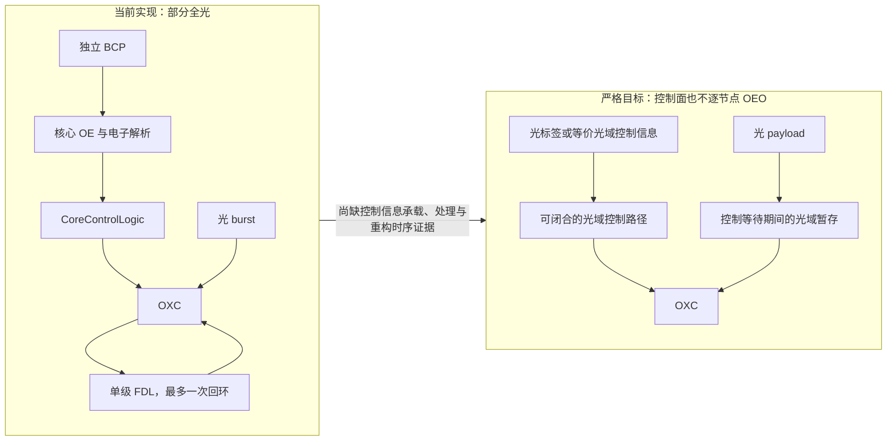
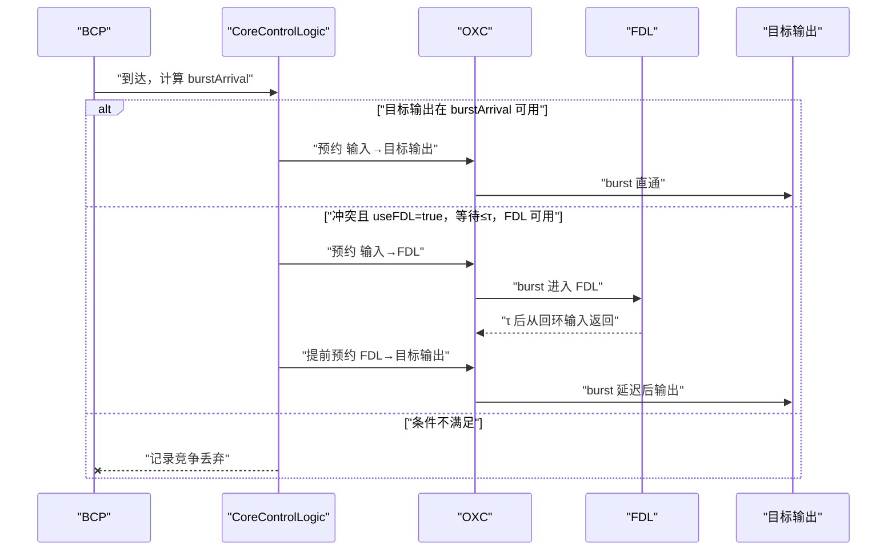

# 第 1 周周会材料：方向确认与阶段基线

> 日期：2026-08-13  
> 本周核心问题：当前仓库已经实现了什么，距离严格全光交换还缺什么证据？

## 一页结论

第 1 周已经完成方向与仓库基线核对。当前代码实现的是“独立 BCP 电子处理 + 数据 burst 光域直通/单次 FDL 回环”的候选机制，不是完整全光交换。`offset=0` 继续作为待验证候选架构，不作为既定结论。

Task 2.2 当前达到“debug 全量编译并链接成功、现有 No-FDL ICMP 场景可运行”的证据等级。release 构建因缺少 `D:/inet/out/gcc-release/src/libinet` 在最终链接阶段失败；确定性 FDL 回环、丢弃分支和旧基线兼容性尚未验证。

## 当前架构—目标架构差距图



这张图支持“FDL 只解决光域暂存/竞争的一部分问题”。它不能支持“控制面已经全光化”。

## 仓库证据表

| 检查项 | 仓库事实 | 证据等级 | 本周判断 |
|---|---|---|---|
| Git 基线 | 当前分支 `task/2.1-fdl-module`；HEAD `1d45cf4` | 已提交 | Task 2.1 有可追踪提交 |
| Task 2.2 | `OBS_CoreControlLogic.cc/.h/.ned` 为未提交修改 | 已实现 | 不能写成已提交或已验证 |
| EdgeNode | 当前工作区对 `src/EdgeNode/` 无差异；四模式仍为 0～3 | 静态核对 | 本周未触碰受保护基线 |
| FDL 约束 | 代码只有一个 FDL 子模块和一个回环端口 | 静态核对 | 结构上保持单级、单次回环候选模型 |
| W=1 配置 | `params.ini` 的 sat1↔sat2 仍配置 3 个数据波长 | 配置核对 | 现有 RingFdlOBS 不能直接作为 W=1 实验证据 |
| 功能测试 | 仓库没有 `fdl_tests.ini` 或三场景确定性配置 | 配置核对 | Task 2.3 尚未开始 |
| release 构建 | 所有对象编译完成，链接时报 `cannot find -linet` | 已编译、未链接 | 缺少 INET release 库，不是源码编译错误 |
| debug 构建 | `make -B MODE=debug` 退出码 0 | 已编译并链接 | 当前工作树可生成 debug 可执行文件 |

## FDL 调度静态时序



这是依据当前 C++ 调度分支绘制的静态时序，不是运行时序证明。第 3 周仍需用确定性场景、EV 日志和 burst 到达时刻逐项验证。

## 真实仿真与日志证据

本周使用当前工作树的 debug 可执行文件运行了 `ICMPTest`，结果保存在：

- `Examples/RingFdlOBS/results/week1-smoke/ICMPTest-0.sca`
- `Examples/RingFdlOBS/results/week1-smoke/simulation_log.txt`

| 从 `.sca` 提取的指标 | 数值 |
|---|---:|
| 两个 ping 源发送总数 | 20 |
| ping 接收总数 | 20 |
| 10 个 CoreControlLogic 的 `fdlUsageCount` 合计 | 0 |
| 10 个 CoreControlLogic 的 `burstLossContention` 合计 | 0 |
| 10 个 CoreControlLogic 的 `burstLossTotal` 合计 | 0 |

实际日志摘录：

```text
Assigned runID=ICMPTest-0-20260813-12:55:26-43144
Setting up network `RingFdlOBS'...
Running simulation...
No more events -- simulation ended at event #4569, t=9.5640001696.
Calling finish() at end of Run #0...
```

证据支持：当前 debug 模型能够初始化并完成现有 `useFDL=false` ICMP 场景；新增 FDL/丢包标量能够写入 `.sca`，且本场景 FDL 使用为 0。

证据不支持：尚无修改前同配置结果的逐标量对照，不能据此宣布完全向后兼容；该场景没有触发 FDL，不能证明回环正确；sat1↔sat2 为 3 波长，不能形成 W=1 性能结论。

## 方向决策表

| 决策 | 第 1 周口径 | 后续门槛 |
|---|---|---|
| 全光交换定义 | 研究文档采用严格口径：数据面和逐节点控制面均不依赖 OEO | 阶段评审仍需领导最终确认 |
| `offset=0` | 候选架构，不预设可行 | 实验 C 必须显式建模标签获取与 OXC 重构时间 |
| FDL | 单级、最多一次回环；当前是候选实现 | 第 3～5 周完成三场景与回归证据 |
| W=1 | 所有正式 FDL 测试与实验必须单波长 | 新测试配置不得继承 sat1↔sat2 的 3 波长例外 |
| EdgeNode | 保留四模式和默认行为 | 仅在实验 B/光标签确有必要时受控扩展 |

## 本周验收与下周门槛

第 1 周验收完成：严格目标、现状差距、候选路线、代码状态和证据边界均已明确。第 2 周只推进 Task 2.2 编译与静态时序修复，不提前进入 FDL 性能实验。

第 2 周门槛：补齐或构建 INET release 库使 `make MODE=release` 完整链接；处理 `git diff --check` 的格式问题；复核 wildcard 路由在 `horizon == arrivalTime` 时的严格比较是否会影响 No-FDL 基线，并在任何行为修改前建立兼容性判据。
