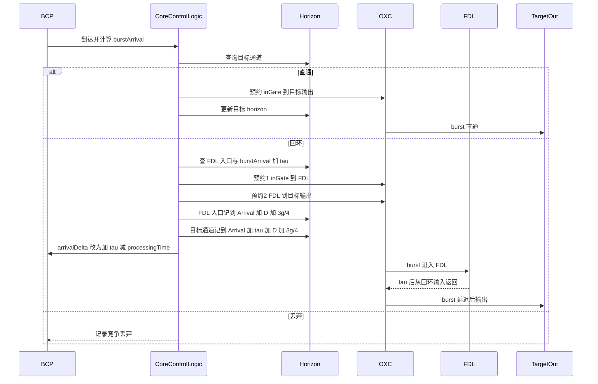

# 第 2 周周会材料：release 链接与静态时序复核

> 日期：2026-08-19  
> 本周核心问题：当前工作树能否生成 release 可执行文件，且 FDL 两段预约、horizon、BCP 时间更新有无已知阻断缺陷？

## 一页结论

第 2 周技术门槛已满足。用户已解决 `-linet` 链接失败并完成 `make MODE=release`。静态复核确认：直通一次预约、回环两段预约间隔为 τ、FDL horizon 记入口占用不加 τ、回环后 BCP offset 增加 τ。上述结论来自源码阅读，**不是**运行时序证明。

Agent 本周未编译、未跑仿真。功能三分支与旧基线兼容性仍属第 3–4 周。

> 当前结论：FDL 调度代码可以进入功能验证；距离严格全光交换仍缺少控制面闭合证据，也缺少回环确实被 burst 使用的仿真证据。

## 本周完成

1. 用户完成 release 链接；`-linet` 不再作为阻塞。
2. 收口 2026-08-14 的静态时序复核，确认无第 2 周阻断问题。
3. 修正 `OBS_CoreControlLogic.cc` 中 `git diff --check` 标出的空白；未改调度判断。

## 本周证据

### 编译结论

| 检查项 | 结果 | 证据等级 |
|---|---|---|
| `-linet` | 用户已解决 | 用户确认；不要再当当前故障 |
| `make MODE=release` | 用户确认已成功，release 可执行文件已生成 | 用户确认。本会话未重跑 `make`；`out/` 被 gitignore，工作区快照未检出 exe |
| debug 构建 | 第 1 周已通过 | 历史证据，本周未重跑 |
| EdgeNode | 本周未改 `src/EdgeNode/` | 静态核对 |

### FDL 调度静态时序



这是依据当前 C++ 画出的静态时序。第 3 周仍须用 `fdl_tests.ini` 的 EV 日志核对两次接通时刻差是否恰为 τ。

### 问题清单

| 编号 | 发现 | 判定 | 是否阻断下周 |
|---|---|---|---|
| 3.2.1 / 3.2.2 | 通配分支 `findNearestLambda` 用严格 `>`，颜色分支用 `<=` | 已接受。路由表波长全为 `*`，颜色分支是死代码 | 否。第 4 周用兼容性 `.sca` 证明 No-FDL 基线 |
| 3.2.3 | `arrivalDelta=0` 时可能 `scheduleAt` 到过去时刻 | 实验 C 前置 | 否 |
| 3.2.4 | FDL 入口空闲只在决策时查一次 | 无问题（单线程事件） | 否 |
| 3.2.5 | 迟到丢弃只进 total 不进 contention | 已补文档口径 | 否 |
| horizon 不加 τ | 看似漏加，实为入口占用 | 正确，须写进论文 | 否 |

## 本周判断

证据支持：release 链接不再阻塞 Task 2.3；核心时序在静态阅读上没有已知阻断缺陷；空白修正不改变行为。

证据不支持：FDL 回环已被真实 burst 使用；`useFDL=false` 与 pre-FDL 逐标量一致；FDL 能降低丢包率。

## 下周门槛（第 3 周）

由用户编译确认后，在 `Examples/RingFdlOBS/` 运行：

```text
../../out/gcc-release/obsmodules.exe -u Cmdenv -f omnetpp.ini -c Test-FDL-Basic -n "../..;.;D:/inet/src"
```

以及 `Test-FDL-TooShort`、`Test-FDL-Off`。通过标准：三分支均被触发；Basic 的 `fdlUsageCount > 0` 且两次 OXC 预约间隔为 τ；TooShort 与 Off 的 `fdlUsageCount == 0` 且 `burstLossContention > 0`，两者标量一致。
