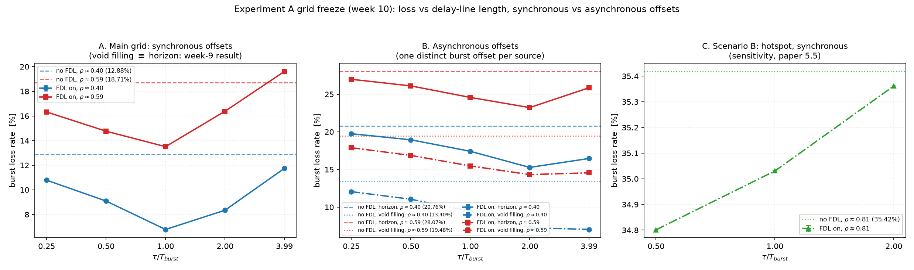

# 第 10 周：ExpA 网格冻结（2026-09-22）

pilot 全部 exit 0：`ExpA-AsyncTauSweep`（40 run）、`ExpA-AsyncNoFDL`（8 run）、`ExpA-HotspotPoint`（6 run），release 构建。
本文档是**参数表冻结**（第 10 周验收项）与 pilot 曲线。图：`research_reports/figures/pilot_grid_freeze.png`。
数据产出于 2026-09-21/22（D4 提交日期是作出裁决的日期，不是 pilot 出数日期）。

---

## 一、冻结网格（参数表）

### 网格 A：全互联，τ 曲线（论文 5.1）

| 维度 | 主模型（同步偏移） | 并列模型（异步偏移） |
|---|---|---|
| 偏移 | `FDL-Scenario`：所有源 `maxOffset = 1 ms` | `FDL-Scenario-Async`：每源一个，700–970 µs，步长 30 µs |
| 负载（`sendInterval`） | 35.6 µs / 21.3 µs（ρ≈0.40 / 0.59，第 7 周重标定） | 同 |
| τ/T_burst | **0.25 / 0.5 / 1 / 2 / 4**（8.6 / 17.2 / 34.4 / 68.8 / 137.4 µs） | 同 |
| 调度器 | **Horizon**（VF 在此模型下恒等于 Horizon，第 9 周结构性结论） | **Horizon / Horizon+VF** |
| FDL | 关 / 开 | 关 / 开 |
| 配置 | `ExpA-TauSweep` / `ExpA-NoFDL`（第 8 周已完成，repeat 5） | `ExpA-AsyncTauSweep` / `ExpA-AsyncNoFDL` |
| 结果目录 | `results/ExpA-TauSweep`、`ExpA-NoFDL`（**模式未记录**） | `results/ExpA-AsyncTauSweep-release`、`ExpA-AsyncNoFDL-release` |
| repeat | 5 | pilot 2 → **批量 5** |
| 构建模式 | 待第 11 周在同一模式下重跑后再出图 | **release（已写进目录名）** |

### 场景 B：热点 ρ≈0.81（论文 5.5，**不并入网格 A**）

| 维度 | 值 |
|---|---|
| 流量 | 九个源对准 sat2（`FDL-Hotspot` 矩阵），`sendInterval = 19.5 µs` |
| 实测 ρ | `maxIslChannelUtilization` 0.805–0.813（FDL 关），与第 8 周标定 0.8074 一致 |
| τ/T_burst | 0.5 / 1 / 2 |
| FDL | 关 / 开 |
| 调度器 | Horizon（同步偏移，同主网格） |
| 配置 / 目录 | `ExpA-HotspotPoint` / `results/ExpA-HotspotPoint-release` |
| repeat | pilot 1 → 批量 5 |

**为什么不并入网格 A**：它是另一套流量矩阵。把不同流量矩阵画进同一条 τ 曲线，会让"τ 最优"与"流量形态"两个变量混在一起；单列后 5.1 的 τ 曲线保持单变量，热点只回答"高负载下结论是否保持"。

---

## 二、pilot 曲线（丢包率 %，全网 ControlLogic 汇总；repeat 2）

### 网格 A

| 负载 | 偏移模型 | 调度器 | 无 FDL | τ/T=0.25 | 0.5 | 1 | 2 | 4 |
|---|---|---|---|---|---|---|---|---|
| ρ≈0.40 | 同步 | Horizon | 12.88 | 10.79 | 9.09 | **6.78** | 8.35 | 11.74 |
| ρ≈0.59 | 同步 | Horizon | 18.71 | 16.32 | 14.76 | **13.51** | 16.38 | 19.61 |
| ρ≈0.40 | 异步 | Horizon | 20.76 | 19.75 | 18.95 | 17.42 | **15.28** | 16.46 |
| ρ≈0.59 | 异步 | Horizon | 28.07 | 26.99 | 26.11 | 24.58 | **23.22** | 25.86 |
| ρ≈0.40 | 异步 | Horizon+VF | 13.40 | 12.06 | 11.04 | 9.44 | **7.26** | 7.04 |
| ρ≈0.59 | 异步 | Horizon+VF | 19.48 | 17.90 | 16.87 | 15.47 | **14.32** | 14.56 |

粗体为该行最小点。同步两行的 12.88 / 18.71 与第 8 周记录逐位一致（参考线口径见第六节）。

### 场景 B（热点，ρ≈0.81）

| FDL | τ/T=0.5 | 1 | 2 | `fdlUsageCount` | `fdlInFlightOccupancy` |
|---|---|---|---|---|---|
| 关 | 35.42（基线） | 35.42 | 35.42 | 0 | 0 |
| 开 | 34.80 | 35.03 | 35.36 | 110,833 / 155,023 / 159,724 | 0.70 / 1.32 / 2.13 |

---

## 三、pilot 给出的四条结论

1. **τ 最优点随偏移模型移动**：同步模型下 τ/T=1 最优（转折点在网格内：6.78 → 8.35 → 11.74）；异步模型下 Horizon 的最优点移到 **τ/T=2**（15.28 → 16.46 已回升）。异步 +VF 在 ρ≈0.40 时到 τ/T=4 仍在下降，说明该组合的最优点还在右边。**因此同步与异步两条曲线必须分开陈述，不能合并成一条"τ 曲线"。**
2. **VF 的收益（异步，7.4–8.9 pp）不少于 FDL 的收益（4.9–6.4 pp）**。也就是说在异步偏移下，一个不增加任何光器件的核心侧调度选择，买到的不比那级延迟线少。
3. **偏移模型本身的效应（约 8 pp）大于两者的边际效应**。同一 `sendInterval` 下，同步 12.88% → 异步 20.76%（ρ≈0.40）。这是本周最需要写进正文的一条：平台默认的偏移假设掩盖了一个比主角更大的变量。
4. **热点上 FDL 基本失效**：ρ≈0.81 时 FDL 只买到 0.1–0.6 pp，而它被使用了 11–16 万次（`fdlInFlightOccupancy` 最高 2.13，即延迟线在飞占用超过 100%，已被打满）。**在饱和瓶颈上，一级 τ 的推迟解决不了问题**——这与低负载下 6.1 pp 的收益形成完整对比，是 5.1→5.5 的论证链。

---

## 四、第 11 周批量清单（本表冻结后执行）

| 结果目录 | 配置 | 迭代规模 | repeat | 预计 run |
|---|---|---|---|---|
| `results/ExpA-AsyncTauSweep-release` | `ExpA-AsyncTauSweep` | 5 τ × 2 负载 × 2 调度器 = 20 | 5 | 100 |
| `results/ExpA-AsyncNoFDL-release` | `ExpA-AsyncNoFDL` | 2 负载 × 2 调度器 = 4 | 5 | 20 |
| `results/ExpA-HotspotPoint-release` | `ExpA-HotspotPoint` | 2 FDL × 3 τ = 6 | 5 | 30 |
| `results/ExpA-TauSweep-<mode>` | `ExpA-TauSweep` | 5 τ × 2 负载 = 10 | 5 | 50 |
| `results/ExpA-NoFDL-<mode>` | `ExpA-NoFDL` | 2 负载 = 2 | 5 | 10 |

合计 210 run。第 8 周的同步批量（60 run）**必须用同一构建模式重跑**后再出图：它的模式没有记录，而 `.sca` 不能跨 debug/release 比较（第 9 周实测 79–84 条末位差异 + 3 ps 结束时刻差）。为不改动第 8 周已有目录，重跑写进带模式后缀的新目录。

运行前每批都要 `python tools/audit_runs.py <目录> --repeat 5`：检查重复次数是否齐、有没有混入上一批的文件。

---

## 五、不得声称清单

1. 不得把同步与异步两条曲线画进同一条"τ 曲线"，也不得用实测 ρ 轴直接比较两者的曲线形状（同一 `sendInterval` 下异步臂实测负载更低）。
2. 不得声称"τ/T_burst≈1 最优"是无条件结论——它只在同步偏移模型下成立；解析文献（`laevens2003single`、`vanhoudt2004channel`）已给出最优粒度依赖 burst 长度分布与负载。
3. 不得把 VF 与 FDL 的边际收益相加成"联合收益"（同一 run 内两者已共同作用）。
4. 不得把热点场景当网格 A 的高负载档（不同流量矩阵）。
5. 不得把本 pilot（repeat 2，热点 repeat 1）当最终数据；`Test-VF-Diag-*` 的 0.2 s 数字不得进任何图。
6. 不得把 `fdlUsageCount` 高当作"FDL 有用"——热点上它被用了 11–16 万次而只买到 0.1–0.6 pp，正是反例。

---

## 六、本周修掉的两个数据卫生问题（都会静默产出错图）

1. **参考线被混入 FDL 开关两条曲线**。作图脚本第一版按迭代变量分组，而 `useFDL` 是配置里写死的、不出现在迭代变量中，于是 `ExpA-NoFDL` 的参考 run 与 FDL 开的曲线被合并平均：ρ≈0.40 的参考线算成 9.94%，而真值是 12.88%（第 8 周记录一致）。改为**按目录划分 family**，并把这个教训写进脚本头注释。
2. **`$repetition` 读不到**。OMNeT++ 4.6 把它放在 `attr iterationvars2` 而不是 `iterationvars`，于是 `audit_runs.py` 第一版把每个 cell 都报成"缺全部重复"。两处解析都已修正。

由此新增两个常驻工具（本地，不入库）：`tools/audit_runs.py`（结果目录清单 + MISSING/DUPLICATE/STALE 检查）、`tools/plot_grid_freeze.py`（本图）。
