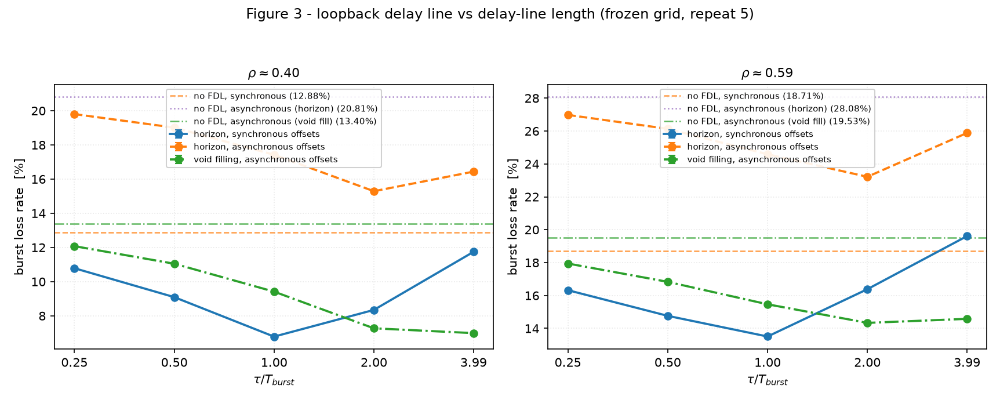
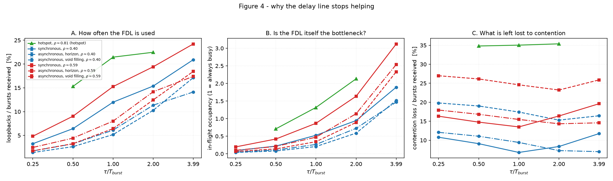
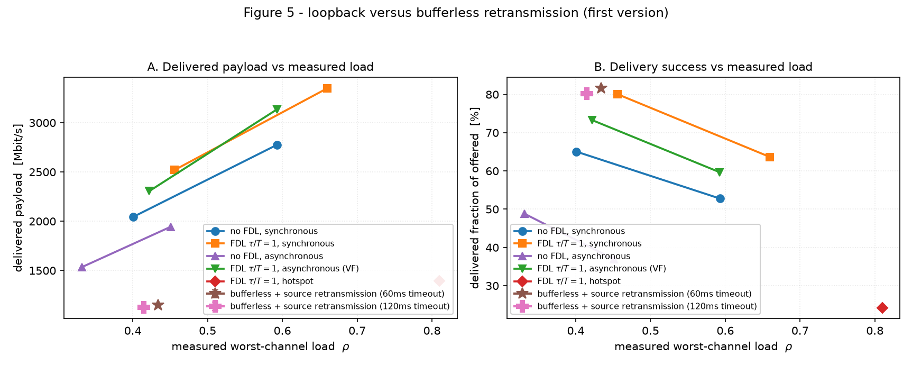

# 第 11 周：批量与图 3–5 初版（2026-09-22）

按第 10 周冻结表跑完 **225 run**（release，repeat 5），每批前后用 `tools/audit_runs.py` 审计；产出图 3–5 初版与逐格汇总表。
数据：`results/ExpA-*-release/`、`results/ExpR-*-release/`；图：`research_reports/figures/fig{3,4,5}_*.png`；逐格数字：`research_reports/figures/batch_summary.csv`。

---

## 一、批量清单与审计

| 目录 | 配置 | run | 审计（repeat 5） |
|---|---|---|---|
| `ExpA-AsyncTauSweep-release` | 异步臂：5 τ × 2 负载 × 2 调度器 | 100 | 20 格齐、无重复、无跨批 |
| `ExpA-AsyncNoFDL-release` | 异步参考线 | 20 | 4 格齐 |
| `ExpA-HotspotPoint-release` | 场景 B 热点 ρ≈0.81 | 30 | 6 格齐 |
| `ExpA-TauSweep-release` | 同步臂（第 8 周同格同种子重跑） | 50 | 10 格齐 |
| `ExpA-NoFDL-release` | 同步参考线 | 10 | 2 格齐 |
| `ExpA-NoFDL-Light-release` | 轻负载无恢复参考（79.8 µs） | 5 | 1 格齐 |
| `ExpR-Retransmit-release` | 重传臂（超时 60 ms） | 5 | 1 格齐 |
| `ExpR-Retransmit-120ms-release` | 重传臂（超时 120 ms） | 5 | 1 格齐 |

合计 225 run，全部 exit 0（重传臂的第三个负载点见第四节，属**故意不跑**）。

---

## 二、第 8 周构建模式已判定：debug

把第 8 周目录与本次 release 重跑按**迭代格**配对（文件名不同——带配置名——所以按 `iterationvars2` 配对），结果：

| 对照 | 结果 |
|---|---|
| `ExpA-TauSweep` vs `ExpA-TauSweep-release` | 50/50 格全部有差异，**平均 181 条/文件**，全部为末位浮点/皮秒级 |
| `ExpA-NoFDL` vs `ExpA-NoFDL-release` | 10/10 格全部有差异，平均 135 条/文件 |

差异形如 `2.000000240199 → 2.000000240197`、`0.00099436 → 0.000994360005`（5 ps），与 2026-09-20 建立的 debug/release 特征一致 ⇒ **第 8 周批量为 debug 构建**（`run-sim.cmd` 默认即 debug）。

**关键点：差异不影响任何结论。** release 重跑的汇总值与第 8 周记录**逐位一致**：

| 指标 | 第 8 周（debug） | 本次（release） |
|---|---|---|
| 无 FDL，35.6 µs | 12.88% | **12.88%** |
| 无 FDL，21.3 µs | 18.71% | **18.71%** |
| FDL τ/T=1，35.6 µs | 6.78% | **6.78%** |
| FDL τ/T=1，21.3 µs | 13.51% | **13.51%** |

因此本周之后所有图都来自单一 release 模式，且第 8 周的结论无需修正。

---

## 三、图 3：τ 曲线（论文 5.1）

丢包率为**全网逐节点 burst 丢包**（`sum(burstLossTotal)/sum(burstsReceived)`，与第 8 周同口径，故数值可直接对照）。

| 负载 | 臂 | 无 FDL | τ/T=0.25 | 0.5 | 1 | 2 | 4 |
|---|---|---|---|---|---|---|---|
| ρ≈0.40 | 同步 Horizon | 12.88 | 10.79 | 9.09 | **6.78** | 8.35 | 11.74 |
| ρ≈0.40 | 异步 Horizon | 20.81 | 19.80 | 19.01 | 17.42 | **15.29** | 16.44 |
| ρ≈0.40 | 异步 +VF | 13.40 | 12.08 | 11.05 | 9.42 | **7.27** | 6.99 |
| ρ≈0.59 | 同步 Horizon | 18.71 | 16.32 | 14.76 | **13.51** | 16.38 | 19.61 |
| ρ≈0.59 | 异步 Horizon | 28.08 | 26.98 | 26.13 | 24.59 | **23.22** | 25.88 |
| ρ≈0.59 | 异步 +VF | 19.53 | 17.94 | 16.83 | 15.47 | **14.33** | 14.58 |

- **同步模型的 V 形最优点在 τ/T=1**（6.78% / 13.51%），τ/T=4 反而差于不加 FDL（11.74 > 12.88？——不，11.74 < 12.88，但 ρ≈0.59 时 19.61 > 18.71 ✓ 与第 8 周一致）。
- **异步模型的 U 形最优点在 τ/T=2**（15.29 / 23.22），到 4 已回升 ⇒ 与同步模型**不是同一条曲线**，必须分开陈述。
- **异步 +VF 的曲线最平、最低**：ρ≈0.59 时整段在 14.3–15.5%，即 VF 把 τ 选择的敏感度也压下去了。

---

## 四、图 4：为什么它不再有用

- **A**：FDL 使用率（回环数/收到的 burst）随 τ 单调上升——τ 越长能被救的越多，这与丢包率非单调是两件事。
- **B**：在飞占用（1 = 一直忙）在 τ/T=4 达 1.9–3.1，**延迟线自己被塞满**；热点工况 0.7–2.1。
- **C**：剩余竞争丢包率。热点曲线（绿）几乎水平在 35%，而同步/异步曲线呈 U/V 形——**热点上 τ 怎么选都救不回来**。
- 结论：τ 的最优值本质是"能救多少"（A 上升）与"延迟线是否成为新瓶颈 + 延迟过长的连锁"（B、C）之间的折中；`fdlInFlightOccupancy > 1` 是"延迟线不再是缓冲而是排队"的判据。

---

## 五、图 5：回环 vs 无缓存重传（论文 5.2）

纵轴为**端到端送达的有效载荷**（回环臂取 sink 的 `rcvdPk` 字节，重传臂取已确认请求数 × 1400 B），横轴为**实测最忙信道负载**。

| 臂 | 实测 ρ | 送达载荷 | 占新发比例 |
|---|---|---|---|
| 无 FDL（同步） | 0.40 / 0.59 | 2046 / 2777 Mbit/s | 65.1% / 52.8% |
| FDL τ/T=1（同步） | 0.46 / 0.66 | **2520 / 3349 Mbit/s** | 80.1% / 63.6% |
| 无 FDL（异步，Horizon） | 0.33 / 0.45 | 1534 / 1944 | 48.8% / 36.9% |
| FDL τ/T=1（异步 +VF） | 0.42 / 0.59 | 2306 / 3135 | 73.3% / 58.0% |
| **无缓存重传（60 ms 超时）** | 0.434 | **1145** | 81.6%（按请求） |
| **无缓存重传（120 ms 超时）** | 0.415 | **1126** | 80.2%（按请求） |

**三条结论：**

1. **同一实测负载下，重传臂送达的有效载荷只有回环臂的一半左右**（1145 对 2046–2520 Mbit/s）。原因是它把自己的带宽花在重传上：`retx/fresh ≈ 1.0–1.09`，即**每发一个请求就重传一次**，线上有用率约 61%。
2. **回环臂在 τ/T=1 相对无 FDL 提升 23%（ρ≈0.40）与 21%（ρ≈0.59）的送达载荷**；异步工况下 VF 相对 Horizon 提升 **61% / 68%**——比延迟线本身的贡献更大。
3. **重传臂的运行区间更窄**：它只能在 79.8 µs（新发 ρ≈0.20）稳定运行；35.6 µs（新发 ρ≈0.40）下即便修掉确认包的填充假象，实测负载仍被自己推到 0.80，积压无界增长（详见第六节）。而回环臂能跑到 ρ≈0.81。

**必须写明的口径**：重传臂的"送达比例"以**请求**为单位、且含重传后的成功；回环臂的送达比例以**包/字节**为单位、不含重传。两者都归一到"新发有效载荷的送达比例"后才可比（图 5B 就是这么画的），正文不得把它们当作同一种丢包率。

---

## 六、实验 R：一个必须处理掉的建模假象 + 一条真实边界

### 6.1 确认包被 padding 放大 2.4 倍（建模假象，已修）

`FDL-Scenario` 的 `minSizeWithPadding = 500B` 是为 ~4.3 kB 的数据 burst 设的，对数据从不生效；但重传臂的确认包是 64 B（含 IP/UDP 与 burst 头约 101 B），被填充到 500 B 后，交换机要占用 **4 µs 而不是 0.8 µs**——而 OBS 窗口由 guard time 主导，这一行把每个确认的代价放大约 **2.4 倍**。
实测代价：未修时该臂**根本不收敛**——活动消息数在 1.5 s 模拟时间内从 47k 涨到 729k（延迟线各臂稳定在 16–19k），32 位进程在 T=1.49 s 以 0xC0000005 结束、没有任何错误信息。
修正：`ExpR-Retransmit` 内覆盖 `**.packetBurstifier[*].minSizeWithPadding = 64B`，让控制流量按真实尺寸计费。这不是调参，而是去掉数据面填充策略带来的假象。

### 6.2 重传臂的真实边界（结果，不是缺陷）

修掉假象后，79.8 µs 完全稳定（活动消息 31k 平坦），但 35.6 µs 仍无界增长（188k–980k，两个超时值都一样）。
原因不是超时设置，而是**开环重传自身**：丢包引发的重传（约 +30% 流量）加上确认流量，把瓶颈推到容量之上；协议栈里没有任何拥塞控制，积压只能增长。
⇒ **结论：无缓存 + 源端重传在这套拓扑中的可用区间比单级回环更窄**（可跑到新发 ρ≈0.2，回环臂到 0.8）。要进入高负载区必须加重传窗口（限速），那是一次独立的设计变更，本周不做、也不假装做了。

**超时标定**：60 ms 对最坏路径（5 跳 ISL、每程 5 ms）偏紧——首次两个 run 出现 266,536 次重传对 244,659 个新发请求、平均完成时延 69 ms（大于超时），说明大量重传是**误触发**。故本周并列跑了 120 ms 版本；两者送达比例相近（80.2% 对 81.6%），说明在 79.8 µs 下重传**主要是真丢包**，不是急躁。两个超时值都保留在图上，因为超时是这条臂的定义的一部分。

**新增工具**：`tools/check_sim_stability.py`（从 Cmdenv 进度行的活动消息数判断某个 run 是否在无界增长，可当批次闸门）。

---

## 七、不得声称清单（本周新增）

1. 不得把同步与异步 τ 曲线画成一条（最优点分别在 τ/T=1 与 2）。
2. 不得把重传臂的"请求送达比例"与回环臂的"包送达比例"混为一谈或直接相减。
3. 不得声称重传臂在高负载下"更差"——正确表述是：**它在高负载下无法稳定运行**，因此没有可比的数据点。
4. 不得把图 5 的横轴换成新发负载后仍作同样陈述：两臂的新发负载不同，只有**实测负载**轴可比。
5. 第 8 周数据是 debug 构建；不得与本次 release 数据逐标量混用（结论层面一致，但混模式逐值比较会得到 180 条/文件的末位差异）。
