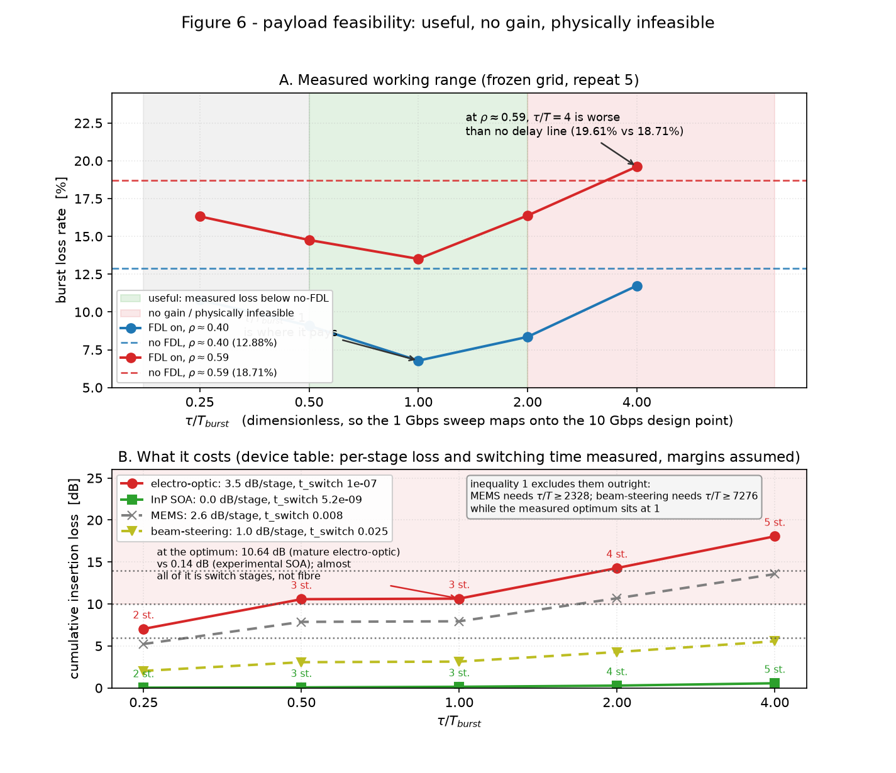

# 第 12 周：图 6 可行性图与 D2 归一化判定（2026-09-22）

第 12 周验收项两项，**都达成**：**图 6 三区可画** → `research_reports/figures/fig6_feasibility.png`；**D2 关闭 → GO** → 归一化表 `ratecheck-output.txt`（本目录）。

---

## 一、图 6：载荷可行性三区

图由两个来源拼成，且**不允许两条代码路径分叉**：性能轴来自第 11 周冻结网格批量（`ExpA-TauSweep-release` / `ExpA-NoFDL-release`，repeat 5），器件轴来自第 8 周器件表，级联档位模型**直接 import `fdl_design.py`** 而不是重算。

### 1.1 面板 A：实测工作区间（全部实测）

| τ/T_burst | ρ≈0.40 | ρ≈0.59 | 该 τ 相对无 FDL |
|---|---|---|---|
| 0.25 | 10.79 | 16.32 | +2.1 / +2.4 pp |
| 0.5 | 9.09 | 14.76 | +3.8 / +4.0 pp |
| **1** | **6.78** | **13.51** | **+6.1 / +5.2 pp** |
| 2 | 8.35 | 16.38 | +4.5 / +2.3 pp |
| 4 | 11.74 | **19.61** | +1.1 / **−0.9 pp（比不加更差）** |

- 绿色带 = **有用区** τ/T ∈ [0.5, 2]（两个负载下收益都 ≥ 2.3 pp，峰值在 1）。
- 两侧灰色/红色 = **无增益→不可行区**：τ/T < 0.5 救不了多少；τ/T > 2 收益快速衰减，且 ρ≈0.59 下 τ/T=4 **反而比不加 FDL 差**。

### 1.2 面板 B：代价（器件参数实测，预算为假设）

按二进制级联 `max_delay = (2^N−1)×step`、步进 0.5 µs、光纤 0.2 dB/km：

| 器件 | τ/T=0.25 | 0.5 | **1** | 2 | 4 |
|---|---|---|---|---|---|
| **电光**（3.5 dB/级） | 7.04 dB（2 级） | 10.57（3 级） | **10.64（3 级）** | 14.28（4 级） | 18.06（5 级） |
| **InP SOA**（0 dB/级） | 0.04 | 0.07 | **0.14** | 0.28 | 0.56 |
| MEMS（2.6 dB/级） | 排除 | 排除 | 排除 | 排除 | 排除 |
| 光束转向（1 dB/级） | 排除 | 排除 | 排除 | 排除 | 排除 |

- **不等式一（τ ≥ 切换时间）**：电光 0.1 µs、SOA 5.2 ns 均远低于有用区（分别相当于 τ/T ≈ 0.029 / 0.0015），**不构成约束**；MEMS 需 τ/T ≥ **2328**、光束转向 ≥ **7276**，比实测最优高 **3 个数量级** ⇒ 这两个器件被**定量排除**（面板 B 用虚线 + 文本框标注，因为画不到同一坐标轴上）。
- **不等式二（累计插损 ≤ 链路预算余量）**：**性能最优档（τ/T=1）在成熟电光开关下要付 10.64 dB，而实验阶段的 InP SOA 只要 0.14 dB**；插损几乎全来自开关级数（光纤本身仅 0.14 dB）。这正是"**成熟度 vs 链路预算**"的取舍，而不是"能不能装"。
- **不等式三（级数 ≤ 质量/体积上限）**：**仍未闭合**，图上以**假设 + 敏感性**出现（级数上限 4 / 6 / 8，画 6；链路余量 6 / 10 / 14 dB，画 10）。图中红色阴影 = 超过 10 dB 假设余量的区域，对电光开关来说 τ/T ≥ 0.5 全部落在里面（**即"有用"与"付得起"在成熟器件上不重叠**），对 SOA 则完全不在里面。

**三区一句话读法**：τ/T ∈ [0.5, 2] 有用；< 0.5 无增益；> 2 既无增益又（对成熟电光器件）超出链路预算。**MEMS/光束转向在任何 τ 都不可行。**

---

## 二、D2：10 Gbps 设计点 vs 1 Gbps 扫描速率

### 2.1 判定用的两个点（无量纲比值全部相同）

新增 `FDL-RateCheckRef`（1 Gbps 孪生点）；`FDL-RateCheck`（10 Gbps）已有。τ/T、T_proc/T、guard/T、offset/T、sendInterval/T 五项比值一一对应（配置注释里列了对照表）。

判据**在 2026-09-14 就已定死**，本周只是执行：主判据 `maxChannelUtilization` < 10%、`fdlUsageCount` < 15%、`carriedBursts` < 10%；辅助判据 `burstLossRate` < 10% **或**绝对差 < 0.1 pp。

### 2.2 结果（`ratecheck-output.txt` 全文）

| 量 | 10 Gbps | 1 Gbps | 原始偏差 | 按 T_burst 归一 | 判定 |
|---|---|---|---|---|---|
| maxChannelUtilization | 0.392468 | 0.391643 | 0.21% | 0.21% | **PASS** |
| fdlUsageCount | 38,512.3 | 50,037.3 | 23.03% | **0.06%** | **PASS** |
| carriedBursts | 340,764 | 442,972 | 23.07% | **0.00%** | **PASS** |
| burstLossRate | 0.0514225 | 0.0513696 | 0.10% | 0.10% | **PASS**（绝对差 0.0053 pp） |

**关键：那两个计数量先"失败"了，原因是测量窗口而不是归一化。**
两次运行的仿真时长差 10 倍（1 Gbps 跑 2 s、10 Gbps 跑 0.2 s），因为无量纲点相同就意味着时长按速率缩放；**但 warmup 不能跟着缩放**——它要排除的是每跳 5 ms 的"填路"瞬态，那是**真实秒**，与码率无关。于是 10 Gbps 那次有 25% 的长度在 warmup 里，1 Gbps 只有 2.5%，测量窗口分别是 **43,655 与 56,752 个 T_burst，比值 1.3000**——而两个计数量的原始偏差正是 **23.03% / 23.07%**，与窗口比完全吻合。按 T_burst 归一后两者分别只差 **0.06% / 0.00%**。

**判定：GO。** 因此第 11 周全部扫描可以按 **τ/T_burst 归一化**在 1 Gbps 下报告，并外推到 10 Gbps 设计点。可引用范围与不可引用范围写在下节。

---

## 三、D2 关闭：能说什么、不能说什么

**能说：**
- 无量纲比值相同的两个点，在 1 Gbps 与 10 Gbps 下**丢包率（0.10%）、最忙信道利用率（0.21%）、按 T_burst 归一的事件率（≤0.06%）一致** ⇒ 以 τ/T_burst 报告扫描结果、并把结论外推到 10 Gbps 设计点是成立的。
- 两级的绝对事件计数不可直接比（差 23%），但**其差异被测量窗口比值 1.3000 完全解释**，不构成尺度依赖。

**不能说：**
- 不能说"两种速率下负载 ρ 相同"——`FDL-RateCheck` 的 0.2 s 与其余 2 s 配置的 ρ 不可比，判据里也没有用 ρ 做比较。
- 不能把 23% 的原始计数差当作"归一化不成立"（那是窗口效应），也不能把它**隐掉**：工具同时打印原始与归一化两列。
- 不能把 D2 的 GO 外推到**未测的**工作点：本次判定只覆盖 τ/T=1、sendInterval/T=1.24 这一个点。

---

## 四、仍未闭合 / 下一周输入

1. **质量体积预算（不等式三）**：仍是唯一假设项，图上以 4/6/8 级敏感性出现；有真实数就回填 `器件参数与三条不等式.md` 并重画图 6。
2. **步进粒度 Δτ**：器件表按 0.5 µs 画；0.1 µs 档会让电光插损从 10.64 dB 涨到 **21.14 dB**（级数 6），是比质量体积更硬的约束——论文里应把这一点写进不等式二。
3. **SOA 0 dB 的借用**：Feyisa 2022 是 8×8 WDM 空间开关，与可调延迟线不同构，引用时须说明是**器件级插损参数**的借用。
4. 第 13 周：`ExpB-Joint` 批量（2×2 边缘 × 核心）+ 分析联合是否移动交叉点。

**不得声称清单（本周新增）**：① 不得把图 6 的"有用区"说成"可行区"——两者对成熟电光器件**不重叠**，这正是本文的结论之一；② 不得把假设的链路余量（10 dB）或级数上限（6）当作实测值；③ 不得引用 MEMS/光束转向的插损数字（它们已被不等式一排除，插损不是排除理由）。
