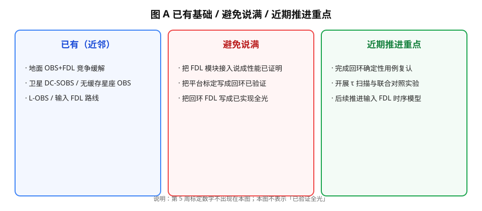
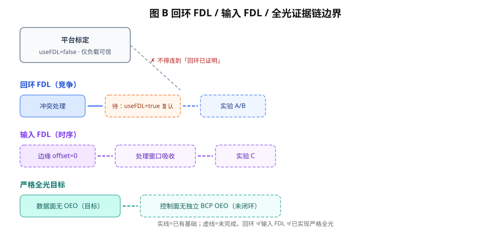

# 第 6 周周会材料：文献定位（go/no-go）

> 决策：2026-09-11；取证修订：2026-09-14  
> 本周核心问题：这篇工作新在哪？若不够新，改发什么？

## 一页结论

**有条件 Go，主叙事收缩。** 公开文献里已经有地面 OBS+FDL、有限 τ 定维、卫星 OBS，以及 **Zhao 2022 的 W=1 且明确不用 FDL**。2026-09-14 补扫 2023–2026 期刊、专利库和中文题录后，**组合缺口仍在**，Go 维持。不能把卖点写成「首次 OBS+FDL」或「首次卫星 OBS」。

可声称的三条款：

1. W=1 星间条件下，单级单次回环 FDL 的 τ/T_burst 工作区间（相对突发时长与载荷延迟器上界）。
2. 边缘四模式 × 核心回环的 2×2：相对「仅 FDL」是否还有稳定收益。
3. （若做实验 C）对齐 L-OBS：输入 FDL 需要多长才能支撑边缘 offset=0；控制面全光只作 future work。

> 当前结论：回环 FDL 仍是值得做的竞争缓解候选，但必须对标 Zhao（不用 FDL、改信令）和 L-OBS（输入 FDL ≈ 1.7 µs）。距离严格全光交换仍缺少输入 FDL 时序与控制面闭合证据。标定 ρ=0.4→35.9 µs 只证明平台负载，不证明回环有效。

## 本周完成

1. 核对近邻并统一 Zhao 取证：SPIE HTML 全文摘录（2026-09-11 抓取、2026-09-14 复核），**不是**出版 PDF，也**不是**「只看过摘要」。摘录入 `refs/extracts/`。
2. 补 PRISMA 式 `检索记录.md`；补扫 2023–2026 OBS/FDL、Google Patents、中文题录。最近专利近邻是 CN108809719A（OBS/OFS 接入选择），不覆盖回环 τ 窗。
3. 建立 `refs/refs.bib`（含 DOI 与访问日期）。Lee 2006 / Qiao 2000 未读原文，已移出必写名单。
4. 写出 `D1-询问稿.md`。回复截止 2026-09-25；**2026-09-28 无回复则冻结 Mouammar 开关表默认值，不再等。**

未改 `src/EdgeNode/`，未跑实验 A，未改调度代码。

## 本周证据

| 已有 | 本项目不能当新贡献 | 仍缺、可有条件声称 |
|---|---|---|
| OBS+FDL 降丢包（Chen 2004；2023–2026 地面刊仍在做） | 「首次提出 OBS+FDL」 | W=1、无波长变换、载荷档位下的 τ 窗 |
| 有限 τ 就够（ChinaCom 2010） | 再扫一遍 τ 本身 | 同一问题在星上单级延迟器约束下的落点 |
| 卫星 OBS + **W=1**（Zhao 2022，且反对星上 FDL） | 「首次卫星 / W=1 OBS」 | 相对 Zhao：何时值得加这一级回环 |
| 卫星光网 OBS/OFS 接入专利（CN108809719A） | 「卫星 OBS 专利空白」 | 接入之后的核心回环是否值得加 |
| 输入 FDL / 同波长标签（L-OBS，试验台 ~1.7 µs） | 把回环写成已支持 offset→0 | 实验 C 的输入 FDL 时序预算 |
| 无缓存 LEO 突发尺寸（Roethig 2026） | 用标定曲线当 FDL 性能 | D1 失败时可改与这篇对话 |

全文底稿：`近邻论文精读分析.md`。决策稿：`新颖性对照与继续条件.md`。检索留痕：`检索记录.md`。

## 本周判断

**支持**：方向可以继续，但论文口径必须收缩；相关工作必须写 Zhao、ChinaCom、L-OBS，并点到 CN108809719A 与中文星载 OBS 题录。

**不支持**：回环已经有效；offset→0 已经可行；第 5 周标定等于 FDL 实验结果；「已通读 Zhao 出版 PDF」。

Chen/Qiao 的 LOBS（控制包打标签，Qiao **2000**）与 L-OBS（同波长光标签 + 输入 FDL）不是同一件事。模糊 / 在线 AI 定 FDL 触碰星载算力红线，不跟随。

## 下周门槛

| 顺序 | 事项 | 说明 |
|---|---|---|
| 立即 | 把 D1 询问稿发给结构/总体 | 截止 2026-09-25；默认冻结 2026-09-28 |
| 计划第 7 周 | Task 1.3：第一阶段实验干净重跑 | 给实验 B 的 Static/Dynamic 基线 |
| 实验 A 前必过 | `useFDL=true` 回环确定性用例 | 冲突→进 FDL→`burstArrival+τ` 再出。跑法见同目录说明 |
| 实验 A 不要开 | — | 确定性用例未过之前，不用 35.9 µs 去扫 `fdlDelayTime` |
